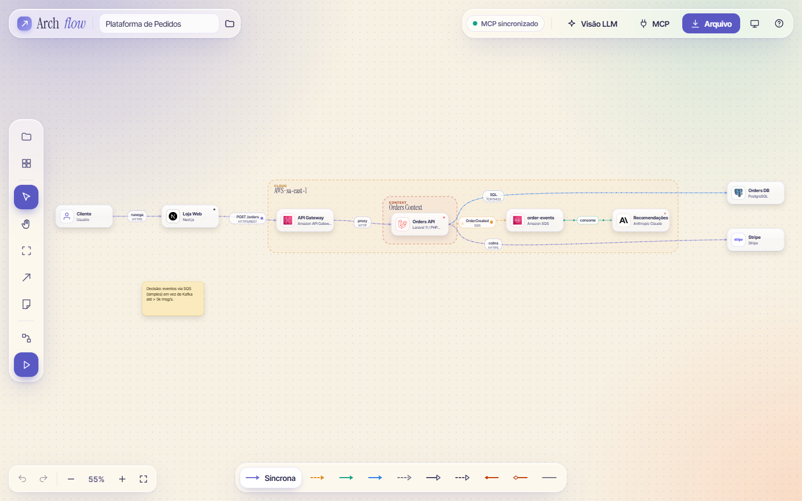
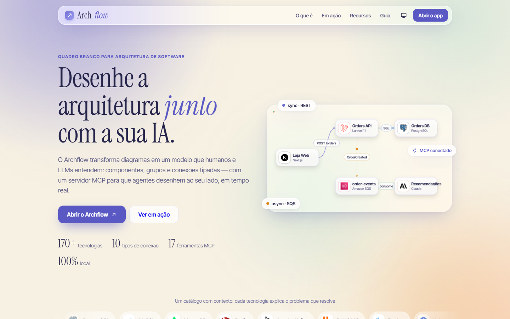
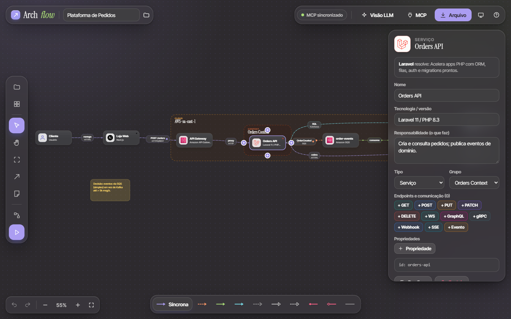
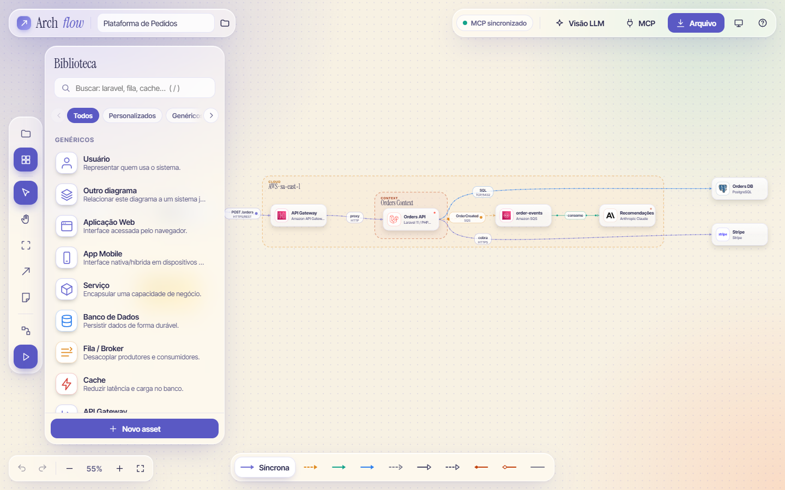
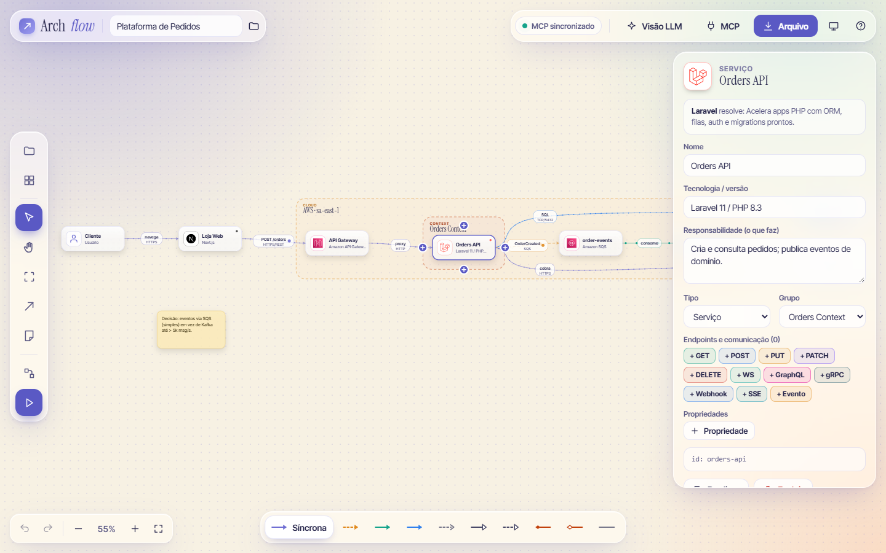
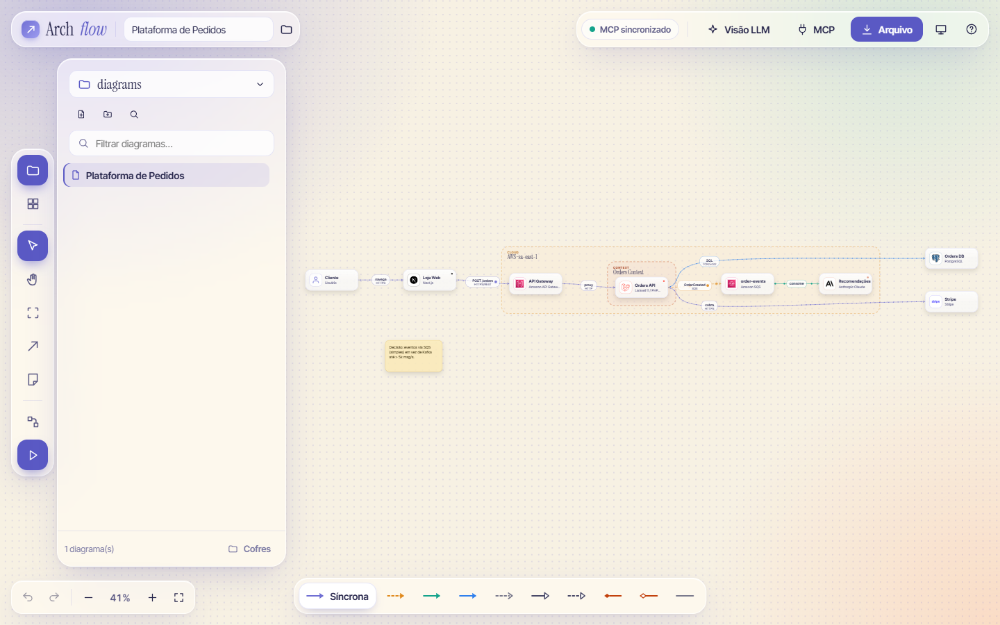
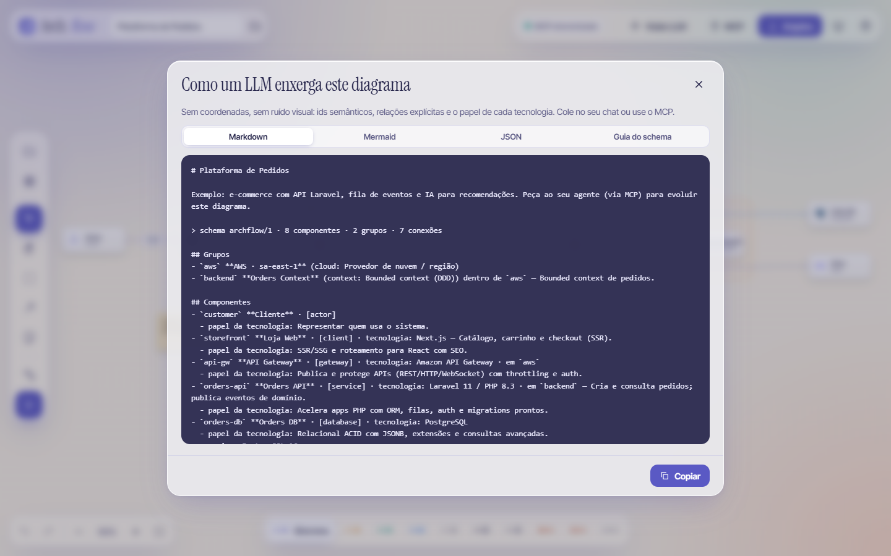
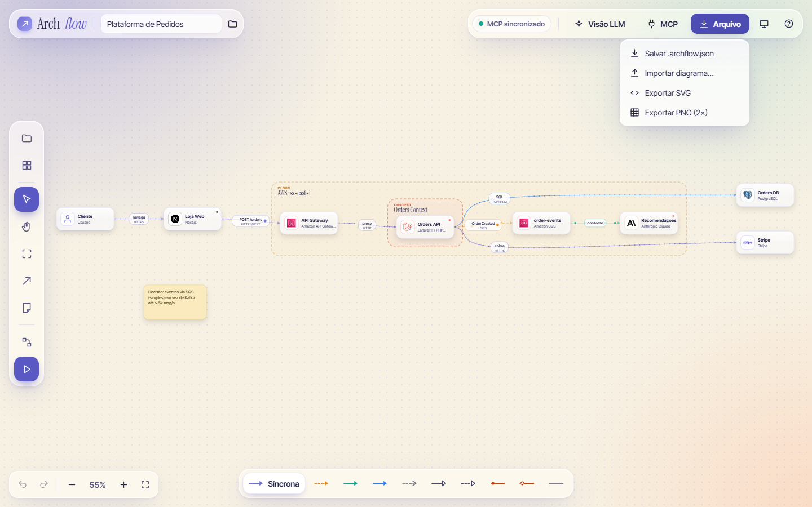
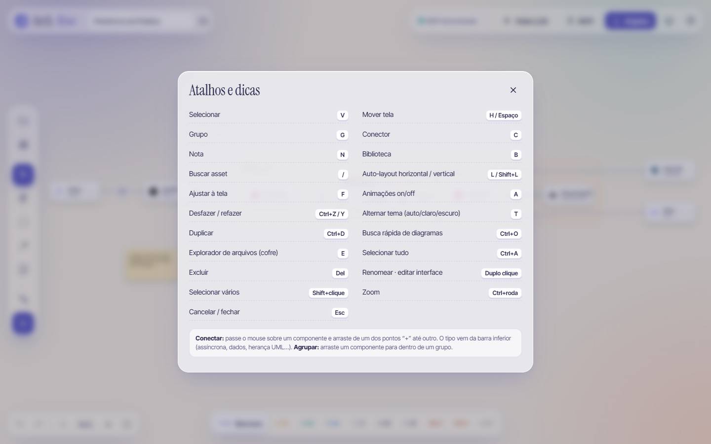
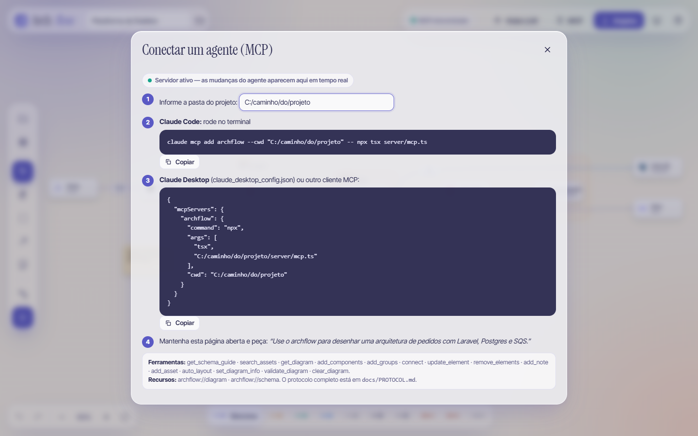

# Archflow

Quadro branco para **arquitetura de software**, inspirado na engenharia reversa do Excalidraw — mas com
modelo semântico (componentes, grupos, conexões tipadas e interfaces), interface *glassmorphism* e um
**servidor MCP** para que LLMs desenhem junto com você, em tempo real.

> Desenvolvido pela **2.end**.



- Tipografia: Instrument Serif + Inter Tight · Cores: `#706fd3` (primária) e `#f7f1e3` (secundária)
- Documentação técnica: [`docs/REVERSE_ENGINEERING.md`](docs/REVERSE_ENGINEERING.md) · [`docs/PROTOCOL.md`](docs/PROTOCOL.md)

## Sumário

- [Visão geral](#visão-geral)
- [Instalação e execução](#instalação-e-execução)
- [Versão para Windows (instalador)](#versão-para-windows-instalador)
- [Guia de utilização](#guia-de-utilização)
- [Conectar um agente (MCP)](#conectar-um-agente-mcp)
- [Cofre de diagramas](#cofre-de-diagramas-estilo-obsidian)
- [Endpoints e referências entre diagramas](#endpoints-e-referências-entre-diagramas)
- [Recursos](#recursos)
- [Atalhos de teclado](#atalhos-de-teclado)
- [Estrutura do projeto](#estrutura)

## Visão geral

| Landing page (`/`) | Aplicação (`/app`) |
| --- | --- |
|  |  |

Diferente de um quadro branco livre, o Archflow guarda **o que cada coisa significa**: um serviço é um serviço,
uma fila é uma fila, e cada conexão tem tipo (síncrona, assíncrona, streaming, UML…). Isso permite que humanos e
LLMs leiam o mesmo diagrama — sem coordenadas e sem ruído visual.

Também funciona em **tema escuro** (automático, claro ou escuro):



## Instalação e execução

Requisitos: **Node.js 22+** (versão usada no desenvolvimento) e npm (ou pnpm).

```bash
npm install
npm run dev      # app em http://localhost:5173/app (a landing fica em /) — já inicia o servidor local (bridge)
```

`npm run dev` sobe tudo: o app **e** o servidor local (porta 7077) que cria cofres, grava os diagramas em disco e fala com o MCP.

**Sem o servidor local** (por exemplo, o app hospedado como site estático) ele entra sozinho no **modo Memória do navegador**:
os cofres ficam no IndexedDB do navegador, com as mesmas pastas, referências entre diagramas, busca e visualização em modal.
O indicador na barra superior fica âmbar ("Memória do navegador"). Limites: nada de pasta em disco, Git, edição externa nem MCP,
e os dados somem se você limpar os dados do site — use **Exportar cofre atual** / **Importar cofre…** (no gerenciador de cofres)
para backup e para levar o cofre a outro navegador.

Produção local:

```bash
npm run build && npm run bridge   # depois abra http://127.0.0.1:7077/app
```

| Script | O que faz |
| --- | --- |
| `npm run dev` | App (Vite) + bridge local |
| `npm run build` | Checagem de tipos + build de produção |
| `npm run bridge` | Servidor local (HTTP/SSE) servindo o build |
| `npm run mcp` | Servidor MCP (stdio) em desenvolvimento |
| `npm run mcp:bundle` | Empacota o MCP (`dist-mcp/`), levado pelo instalador em `resources/mcp/` |
| `npm run skill` | Embute `skills/archflow/SKILL.md` no app |
| `npm run app:pack` | Gera o app desempacotado (`release/win-unpacked`) para testes |
| `npm run icons` | Regenera os ícones do catálogo |
| `npm run typecheck` | Apenas checagem de tipos |
| `npm run app` | Abre o app desktop (Electron) sem gerar instalador |
| `npm run app:dist` | Gera o instalador do Windows em `release/` |
| `npm run app:icon` | Regenera o ícone do app (`build/icon.*`) |

## Versão para Windows (instalador)

Não quer rodar via Node? Há um **instalador para Windows (x64)** com o app desktop — uma janela própria com o servidor local (bridge) embutido, sem terminal e sem navegador.

1. Baixe o `Archflow Setup <versão>.exe` na página de [**Releases**](https://github.com/joao2end/Archflow/releases/latest) (o repositório é privado: é preciso estar logado no GitHub com acesso).
2. Execute o instalador (pede permissão de administrador). Ele instala em `C:\Program Files\Archflow`, permite trocar a pasta e cria atalhos no Menu Iniciar e na Área de Trabalho.
3. Abra o **Archflow** pelo atalho.

Detalhes:

- O instalador **não é assinado digitalmente**: o SmartScreen pode avisar na primeira execução (*Mais informações → Executar assim mesmo*).
- O app usa a porta **7077**. Se já houver um bridge nela (por exemplo, `npm run dev` rodando), ele é reutilizado em vez de subir outro.
- Os cofres e a lista de cofres ficam em `~/.archflow` (compartilhados com a versão de desenvolvimento); sem configuração prévia, o cofre padrão é `Documentos\Archflow`.
- Para conectar um agente (MCP) ao app instalado, veja [Conectar um agente](#conectar-um-agente-mcp) — o bridge fica em `http://127.0.0.1:7077` e o MCP é o próprio `Archflow.exe --mcp`.

### Gerar o instalador

```bash
npm install
npm run app:dist   # build + bundle do Electron + instalador NSIS em release/
```

Se o `electron-builder` falhar com `EPERM` ao extrair o Electron (comum com antivírus ativo), rode `node node_modules/electron/install.js` e depois
`npx electron-builder --win nsis -c.electronDist=node_modules/electron/dist`.

## Guia de utilização

### 1. Monte o diagrama com a biblioteca

Pressione **`B`** (ou clique no ícone de grade no dock) para abrir a **Biblioteca**: ~155 tecnologias organizadas por
categoria (Linguagens, Frameworks, Bancos de Dados, Mensageria, AWS, Google Cloud, Azure & IBM, IA & LLM, Modelos de IA…).
Cada item explica **o problema que resolve**. Use a busca (**`/`**) para achar rápido — por exemplo `laravel`, `fila` ou `cache` —
e **arraste** o item para o quadro. Precisa de algo que não existe? **Novo asset** cadastra uma tecnologia sua (ícone, cor, descrição).



### 2. Conecte os componentes

1. Escolha o **tipo de conexão** na barra inferior: *Síncrona*, *Assíncrona*, *Streaming*, *Acesso a dados* ou uma relação UML
   (*Dependência*, *Herança*, *Implementa*, *Composição*, *Agregação*, *Associação*).
2. Passe o mouse sobre um componente e arraste de um dos pontos **"+"** até outro componente (ou use a ferramenta Conector, **`C`**).
3. Clique na conexão para dar um rótulo, definir o traçado (curva, ortogonal ou reta) e descrever a **interface**
   (operações, métodos, payloads e contrato OpenAPI/AsyncAPI).

### 3. Agrupe e organize

- **`G`** cria um **grupo** (cloud, rede, camada, *bounded context*…). Arraste um componente para dentro para agrupá-lo; grupos podem ser aninhados.
- **`N`** adiciona uma **nota** (útil para registrar decisões de arquitetura).
- **`L`** (horizontal) / **`Shift+L`** (vertical) aplica o **auto-layout**; **`F`** ajusta o zoom para caber tudo.
- **`Ctrl+Z` / `Ctrl+Y`** desfazem e refazem; **`Ctrl+D`** duplica; **`Del`** exclui.

### 4. Edite os detalhes no inspetor

Clique em um componente para abrir o **inspetor** à direita: nome, tecnologia/versão, responsabilidade (o que faz), tipo, grupo,
**endpoints e comunicação** (`+ GET`, `+ POST`, `+ GraphQL`, `+ gRPC`, `+ Webhook`, `+ SSE`, `+ Evento`…) e propriedades livres.



### 5. Organize seus diagramas no cofre

Pressione **`E`** para abrir o **explorador do cofre**: árvore de pastas e diagramas, filtro, criar diagrama/pasta, renomear (`F2`),
duplicar, arrastar para mover e menu de contexto (botão direito). **`Ctrl+O`** abre a busca rápida de diagramas.



### 6. Compartilhe com uma LLM

Clique em **Visão LLM** para ver o diagrama como um modelo de linguagem o enxerga — ids semânticos, relações explícitas e o papel
de cada tecnologia — em **Markdown**, **Mermaid** ou **JSON**, mais o **Guia do schema**. Cole no seu chat ou use o MCP.



### 7. Exporte

O menu **Arquivo** salva o diagrama como `.archflow.json`, importa outro diagrama e exporta em **SVG** ou **PNG (2×)**.



### 8. Peça ajuda

O botão **?** (ou a tecla `?`) mostra todos os atalhos e dicas.



## Conectar um agente (MCP)

O servidor MCP (stdio) está **embutido no `Archflow.exe`** — sem Node, npm nem código-fonte. O botão **MCP** da barra superior
mostra os comandos já com o caminho do seu exe, e a aba **Skill para os modelos** entrega o guia de uso para o agente:



**Um clique:** na modal, **Instalar** grava a entrada `archflow` no Claude Desktop, Cursor ou Windsurf (preserva o resto do arquivo e faz cópia `.bak`); **Abrir no Cursor** usa o deeplink de instalação. Reinicie o cliente depois.

**Manual** (troque pelo caminho do seu exe; o padrão do instalador é `C:Program FilesArchflowArchflow.exe`):

```bash
claude mcp add --scope user archflow -- "C:Program FilesArchflowArchflow.exe" --mcp
```

```json
{ "mcpServers": { "archflow": { "command": "C:\Program Files\Archflow\Archflow.exe", "args": ["--mcp"] } } }
```

Quando o agente conecta, o servidor **abre o app Archflow sozinho** (se ainda não estiver aberto) e edita o diagrama pelo bridge dele — você acompanha ao vivo.
Em desenvolvimento use `npx tsx server/mcp.ts` (o botão MCP mostra o comando certo para cada modo).

### Skill para os modelos

`skills/archflow/SKILL.md` ensina o modelo a usar o Archflow (fluxo, tools, vocabulário, erros comuns). Ela fica disponível:

- na modal **MCP → Skill para os modelos**: instalar no Claude Code (`~/.claude/skills/archflow/`), copiar, baixar `SKILL.md` ou baixar como regra do Cursor (`.cursor/rules/archflow.mdc`);
- pelo próprio MCP: resource `archflow://skill` + `instructions` enviadas ao cliente na conexão.

O texto é editado em `skills/archflow/SKILL.md`; `npm run skill` (já parte do `npm run build`) o embute em `src/shared/skill.generated.ts`.

Com o app aberto (o indicador **MCP sincronizado** fica verde), peça: *"Use o archflow para desenhar uma arquitetura de pedidos com Laravel, Postgres e SQS"*.
Edições do agente aparecem ao vivo (`Ctrl+Z` desfaz).

## Cofre de diagramas (estilo Obsidian)

Um **cofre** é uma pasta qualquer do disco; seus diagramas são arquivos `.archflow.json` em subpastas livres. A pasta oculta `.archflow/` guarda `vault.json` e a lixeira — como o `.obsidian/`.

- **Explorador** (tecla `E` ou botão do cofre no dock): árvore de pastas e diagramas, filtro, criar diagrama/pasta, renomear (`F2`), duplicar, **arrastar para mover** entre pastas, menu de contexto (botão direito) e exclusão para a lixeira do cofre.
- **Vários cofres:** o nome do cofre no topo do explorador abre o gerenciador — *Criar novo cofre* (nome + local), *Abrir pasta como cofre* e a lista dos seus cofres. Na primeira execução o app oferece isso automaticamente.
- **Busca rápida** (`Ctrl+O`): encontra qualquer diagrama do cofre por título ou caminho; se não existir, cria.
- Cada pasta lembra o último diagrama aberto; a árvore lembra quais pastas estão expandidas. Edições externas (editor, git) são recarregadas ao vivo.
- **MCP:** `list_diagrams`, `open_diagram`, `new_diagram { title, folder? }`. O agente nunca troca de cofre — isso é decisão sua.
- Sem o bridge, o app segue funcionando com salvamento no navegador + importar/exportar JSON.
- Config: `~/.archflow/config.json` (cofres, ativo, último aberto). Variáveis: `ARCHFLOW_DATA` (cofre padrão), `ARCHFLOW_CONFIG`, `ARCHFLOW_PORT`.

## Endpoints e referências entre diagramas

- **Componentes de comunicação:** um serviço *expõe* endpoints — REST (GET/POST/PUT/PATCH/DELETE), GraphQL (query/mutation/subscription), WebSocket, gRPC, Webhook, SSE e Evento. Adicione pelos botões "+ GET", "+ POST"… no inspetor do serviço, ou solte um item da categoria **Comunicação** da biblioteca sobre ele. Eles ficam presos ao serviço e aceitam conexões.
- **Referência a outro diagrama:** arraste um diagrama do explorador para o quadro (ou use *Outro diagrama* na biblioteca). Clique nele para **visualizar em modal**; dentro do modal, clique em outras referências para entrar nelas e use **← →** (ou Alt+←/→) para navegar. *Editar* abre o diagrama e o botão **Voltar** retorna. O explorador mostra **Referenciado por** (backlinks) e os links são atualizados ao renomear/mover arquivos.
- MCP: `add_endpoints`, `get_diagram_outline` e `add_components` com `ref`.

## Recursos

- **Biblioteca** com ~155 tecnologias (AWS, Google, Azure/IBM, Anthropic, OpenAI, modelos de IA (Claude Opus/Sonnet/Haiku, GPT, Gemini, Llama…), PHP/Laravel, Swagger, MySQL/MariaDB/Postgres/Mongo, mensageria, DevOps…), cada uma com *o problema que resolve*; cadastre as suas (ícone, cor, descrição).
- **Conexões**: síncrona, assíncrona, streaming, dados + UML (dependência, herança, implementação, composição, agregação, associação), animadas; traçado curva/ortogonal/reta; **interface** (operações, métodos, payloads, contrato OpenAPI/AsyncAPI).
- **Grupos** aninháveis (cloud, rede, camada, bounded context…), auto-layout, undo/redo, exportação JSON/SVG/PNG, **Visão LLM** (Markdown/Mermaid/JSON).
- Tema **claro, escuro ou automático** (botão na barra superior ou `T`; a escolha fica salva).

## Atalhos de teclado

| Ação | Atalho | Ação | Atalho |
| --- | --- | --- | --- |
| Selecionar | `V` | Mover tela | `H` / `Espaço` |
| Grupo | `G` | Conector | `C` |
| Nota | `N` | Biblioteca | `B` |
| Buscar asset | `/` | Auto-layout horizontal / vertical | `L` / `Shift+L` |
| Ajustar à tela | `F` | Animações on/off | `A` |
| Desfazer / refazer | `Ctrl+Z` / `Y` | Alternar tema | `T` |
| Duplicar | `Ctrl+D` | Busca rápida de diagramas | `Ctrl+O` |
| Explorador do cofre | `E` | Selecionar tudo | `Ctrl+A` |
| Excluir | `Del` | Renomear · editar interface | Duplo clique |
| Selecionar vários | `Shift+clique` | Zoom | `Ctrl+roda` |
| Cancelar / fechar | `Esc` | Ajuda | `?` |

## Estrutura

```
src/shared   schema, catálogo, operações semânticas, layout, describe()  (usado por UI, bridge e MCP)
src/ui       canvas SVG, painéis, modais, store, sincronização
server       bridge HTTP/SSE e servidor MCP
electron     casca desktop (Electron) que embute o bridge
build        ícones do app (icon.ico / icon.png)
scripts      build-icons.ts (extrai ícones do Iconify logos/simple-icons) · build-app-icon.ts (ícone do app)
docs         documentação técnica e screenshots usados neste README
```

Ícones: Iconify *logos* e *simple-icons* (marcas pertencem aos respectivos donos; uso para identificação em diagramas).
